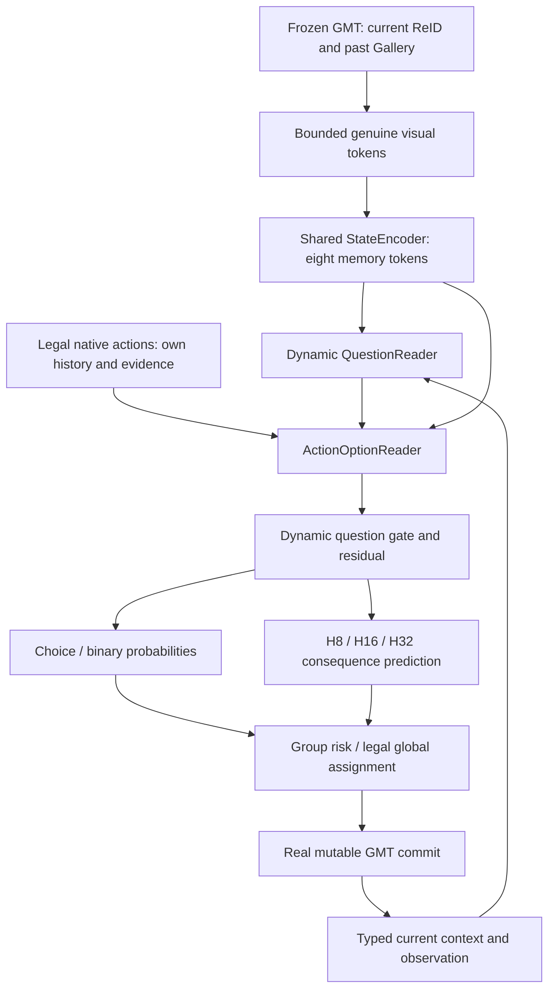

# Phase XII architecture freeze v1

This is an independently implemented Visual System-One / Jev-style MCMOT
architecture. References and license hashes are in the external architecture
audit. Freeze precedes network implementation, tests, training and validation.
No private TypeSafe Jev or RLCD reproduction is claimed.

## Evidence available before choosing dimensions

The actual frozen cache at TRAIN video12/frame0/view0 contains 7 detections,
`reid_features[7,1152]`, boxes, detection scores and image size. Cache producer
`jev_perception_cache.py` stores no ROI patch tokens. Native Instances and
ordered Gallery expose real ReID observations. Gallery does not store reliable
per-observation camera/time fields; these must be recovered from genuine ordered
native history when available, otherwise marked missing, never invented.
GMT perception and association backbone remain frozen. Visual vectors are L2
normalized independently, with a zero-safe denominator. Numerical state64 and
evidence12 use TRAIN-only normalization, constant dimensions explicitly zeroed.

## Tensor contract

B denotes independent states, Q actual question instances, K dynamic options,
H=3 bounded observations per identity (recent, first/long, ordered-gallery mean),
T current detections plus at most three tokens per candidate, d=128, heads=4.
Eight latent tokens bound shared-state self-attention; input pooling reads all
candidate evidence, without pruning legal options or attending to unbounded
gallery observations. A single absent-state sentinel prevents all-masked attention.

| Tensor | Shape | Source / meaning |
|---|---|---|
| state_visual | B,T,1152 | current detection vectors + bounded true history |
| state_metadata | B,T,8 | kind one-hot4, log1p gallery length, log1p actual age, camera value (0/1 or missing -1), metadata-known flag |
| state_mask | B,T | true available observations only |
| StateMemory / StateMask | B,8,128 / B,8 | one projected and pooled shared state |
| question_visual | B,Q,1152 | actual current detection/new observation |
| question_context | B,Q,64 | native state64, regenerated for task/commit |
| question_type / question_mask | B,Q | MATCH_ID=0, REACTIVATE_ID=1, UPDATE_MEMORY=2 |
| option_visual | B,Q,K,3,1152 | actual identity recent/first/mean; nonidentity uses current vector |
| option_visual_mask | B,Q,K,3 | real observations, padding masked |
| option_evidence | B,Q,K,12 | native scores/threshold/support/visual consistency/context |
| option_kind | B,Q,K | ASSOCIATE=0, DEFER=1, REACTIVATE=2, NEW=3, WRITE=4, KEEP=5 |
| option_mask | B,Q,K | exact legal action space |
| QuestionState | B,Q,128 | dynamic context + question-to-state read |
| ActionRepresentations | B,Q,K,128 | own evidence + question/state reads + gate |
| conditional choice probabilities | B,Q,K | masked softmax for MATCH/REACT |
| binary WRITE probability | B,Q | masked WRITE/KEEP distribution for MEMORY |
| consequence prediction | B,Q,K,3 | predicted H8/H16/H32, never true future inputs |
| abstain logit / risk flag | B,Q | separate output; untrained/rule-based risk |

Runtime identity and detection references live in `ActionOption` execution
payloads only. They are absent from floating model tensors. Inputs reject
nonfinite values and unknown fields, GT/anchors/future targets/evaluator outputs.
Supervision is a separate offline object; unexecuted utility remains NaN.

## Actual modules and signatures

`StateEncoder(OnlineVisualState) -> (StateMemory, StateMask)`: shared visual
projection 1152->128, metadata projection 8->128, latent cross-attention over
masked genuine tokens, residual/norm/FFN, one latent self-attention block.

`QuestionReader(StateMemory, QuestionDescriptor, DecisionContext) -> QuestionState`:
current visual projection + context64 projection + type descriptor, followed by
question-to-memory cross-attention and residual/norm/FFN. Each question instance
has its own real inputs. Learned type descriptors alone are insufficient.
No question-to-question attention: another query cannot contaminate an answer.

`ActionOptionEncoder`: shared visual projection of bounded observations,
question-conditioned read over the three observations, evidence12 projection
and semantic action descriptor. All candidate-wise parameters independent of K.

`ActionOptionReader(QuestionState, StateMemory, Options, Masks)` reads the dynamic
question and state with residual attention, plus masked mean/max candidate
competition. Its normalized option representation interacts with
`tanh(QuestionProjection(QuestionState))` via elementwise multiplication and
an explicit residual. Final normalization and FFN prevent uncontrolled scale.

`TypedDecisionHeads`: shared candidate-wise choice projection for MATCH/REACT,
separate binary readout for WRITE/KEEP, independent abstain projection. Type
temperature buffers default to 1 and can be fitted only on labeled validation
scope, with that scope stated. No learned abstain probability claim without labels.

`ConsequenceValueHead`: shared action-conditioned 128->128->3 current-evidence
prediction. Executed-action H8/16/32 utility only; unknown targets masked before
loss. Q is conditional single-edge value, not a joint assignment critic.

`VisualJev.encode_state`, `encode_questions`, `score_questions` explicitly
separate the three stages. Shared parameters are used by all three typed tasks.
State memory may be reused across questions on exactly the same immutable state;
state-dependent questions/options are rebuilt after any native commit.

## Capacity and computation preregistration

Initial d128, four heads, FFN256, one state pooling/self block, one question
reader, one option reader. Estimated trainable parameters 0.7M–1.1M, target
0.3M–2M. Projection MAC includes 1152*128 per genuine visual token; latent read
cost O(8*T*d), option reads O(Q*K*(8+3)*d), never O(gallery_length squared).
Report actual parameter and profiled MAC totals for actual T,Q,K; theoretical
MAC counts exclude softmax/norm and cannot substitute for latency measurements.
Same-visual SetTransformer gets the same shared encoder, visual/context/evidence
projections and typed output/utility heads, with two ordinary candidate set
attention/FFN blocks. Capacity differences are reported and a fair matched-width
control is used if outside 20%. Same-visual DeepSets is an additional control.

## Action and training semantics

MATCH has existing identities and DEFER, never START_NEW. REACTIVATE has actual
eligible stale identities and START_NEW. MEMORY has WRITE/KEEP after final ID
commit. ABSTAIN is an independent fallback request; it itself does not allocate
an ID. Conflict-connected groups fall back through the original lawful GMT
assignment jointly. Existing per-camera capacity1 and cross-camera reuse remain.
Newborn initialization is mandatory native bookkeeping, not a memory training label.

Known-candidate multi-positive conditional CE excludes UNKNOWN from its
denominator. Pairwise softplus ranking uses only executed non-tied utility pairs.
SmoothL1 consequence regression uses TRAIN-scaled executed H8/16/32 deltas only.
Joint objective CE + rank + 0.1 consequence. Choice preference is choice logit
plus 0.25 standardized predicted H32 for joint; all controls get identical
objective, heads, labels and budgets. H32-only diagnostic uses utility ranking.
Without-H32 uses correctness CE only; without-consequence keeps executed ranking
on choice logits but removes Q prediction/inference contribution.
DEFER/NEW/ABSTAIN have no qualified supervised positives in v3, so are not
fabricated negatives or positives. Deployment defer follows the common frozen
GMT score-threshold baseline offset. Risk fallback defaults to conditional
existing confidence <0.55 or top-two margin <0.10 (one candidate margin=1),
registered before performance evaluation; report disabled-risk ablation and
coverage/risk on known labels separately from UNKNOWN selection.

Changes after this freeze require a separately hashed amendment preserving v1,
reason and whether validation results were already visible.
