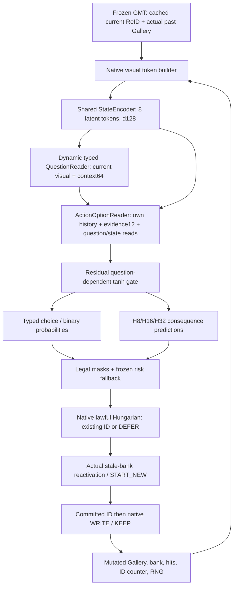
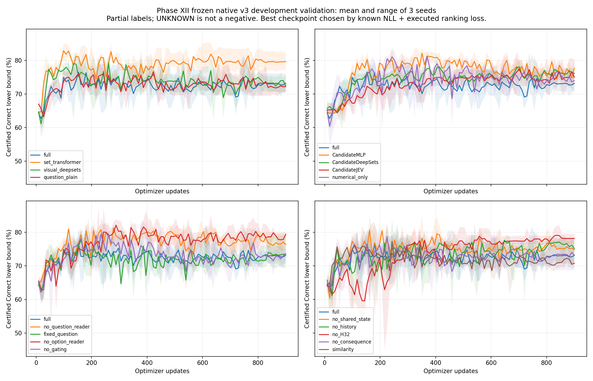
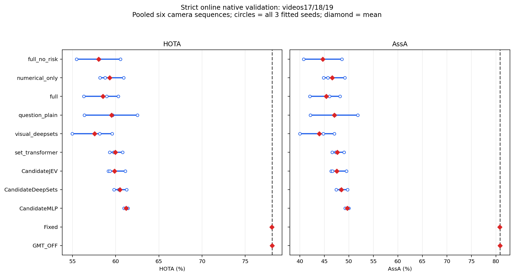
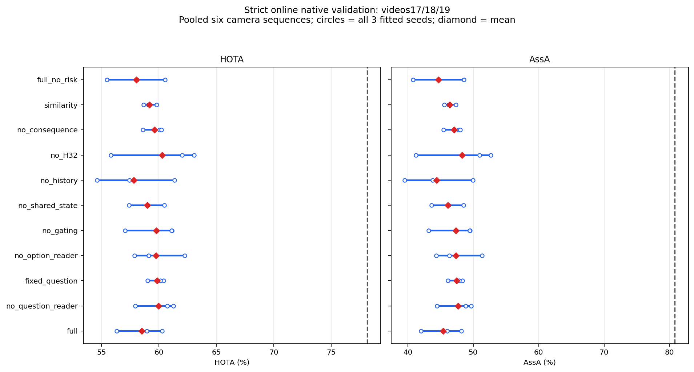

# Phase XII — Visual System-One / Jev-style MCMOT research report

结论：结构和原生执行接口验收通过，MATCH 完成真实训练；当前性能与部署科学 Gate 为 **NO_GO**。Full 严格在线 HOTA 三种子均值 58.524，GMT OFF 78.110，差值 -19.587。不能将结构成立写成结构收益成立。

本阶段从 Phase X `957644fa2e300388a603fb352f73917e385bcd24` 独立研究分支开始。Phase V–X 的源码提交、报告、B2 权重、221 前缀、840 分支、53 个修正 H32 标签与旧 Tiny FAIL 保持原样。heldout20/21/22 封存，未启动 Full24，未读取官方 TEST。

## 实际结构与证据

公开实现锁定 Valen `5f775c4f6747216d6085d088c9004af66371638d`、OmniJev `14dbec4f71e194852c8d7b88ab36ef639493f400`、Visual-Jev `a392eaedfa41adae348f9767b55c0f54b3a13b57`、NanoJev `76fdfc9ecdca45a9bcef17991a07d3041a87685a`；前三者 Apache-2.0，NanoJev MIT。路径、许可证与逐文件 SHA 见 [实际源码审计](JEV_PHASE12_EXTERNAL_ARCHITECTURE_AUDIT.md) 和 `EXTERNAL_CODE_MANIFEST.json`。没有宣称复现私有 TypeSafe Jev 或完整 RLCD。

| 张量 | 实际维度与来源 |
|---|---|
| OnlineVisualState.visual | `[B,T,1152]`；当前检测 + 每个身份 recent/first-resident/gallery-mean 三个真实 token |
| metadata / mask | `[B,T,8]` / `[B,T]`；类型、Gallery 长度、真实可知时间/相机，未知标记明确 |
| StateMemory | `[B,8,128]`；一次状态编码服务同批 Q 个问题 |
| QuestionDescriptor | visual `[B,Q,1152]`、context `[B,Q,64]`、真实 task type/mask |
| QuestionState | `[B,Q,128]`；动态当前输入与问题到状态 cross-attention |
| ActionOptions | `[B,Q,K,3,1152]` + evidence12、history/legality mask；ID 仅为执行引用 |
| ActionRepresentation | `[B,Q,K,128]`；每个候选读取自己的问题、共享状态和竞争上下文 |
| Choice / Q | `[B,Q,K]` / `[B,Q,K,3]`；H8/H16/H32 输出为 TRAIN 标准化效用预测 |

实际 GMT 提供 1152D ReID，未假设 ROI patch tokens。历史 attention 长度固定为 3 个可解释视觉观测，每个身份的均值读取实际 Gallery；不对整个长期 Gallery 做 self-attention。first token 是当前 resident 第一元素，不承诺等于未经原生 promotion/alias 修改的初生向量。

源码在 `gtr/modeling/visual_jev_mcmot/`：`visual_state_encoder.py`、`typed_question_reader.py`、`action_option_encoder.py`、`option_reader.py`、`typed_decision_heads.py`、`consequence_value_head.py`、`lifecycle_controller.py`。普通 MLP、DeepSets 与旧静态 CandidateJEV 单独作为数值对照；旧两个输出增加同一 2→3 效用投影共 9 参数，不称为新版 Jev。

CPU/CUDA、K=0/1/2/7/41、动态 Q、空集合、合法动作类型、mask、nonfinite 拒绝、梯度与视觉敏感性、候选排列等变测试通过。受控“相同状态与视觉、不同动态问题产生不同正确动作”的功能任务，动态 Reader 100%，固定问题 50%；这证明功能路径，不能当作 MOT 成功。

原始 221 个前缀全部重新验证 OFF/SHADOW 的完整有序 Gallery/bank/hits/ID/RNG 与当前、下一帧提交。真实候选干预改变 committed ID、正确单次写入并改变下一步真正的候选分数。另以真实 stale-bank 引用证明 ABSTAIN 保持原生状态、DEFER 先查询 bank、恢复旧身份可避免 birth，START_NEW 才分配新 ID。强制动作测试为未训练工程验证，未充作科研性能或监督资格。

## 训练和离线开发集结果

Frozen native v3：TRAIN 132、Validation 94，verified correction 74/59；不是完整视频的代表性 IID 分类样本。视觉数据 SHA `67f6dcf5acca15c6fa63d20674e9b0c9c8151b7943bd2b354c699a48ca0629e1`。未执行 Q 保持 NaN，UNKNOWN 不作负例。归一化与多尺度效用缩放只用 TRAIN；checkpoint 根据已知范围 NLL + 已执行分支 ranking loss 选择，温度仅在已知候选范围拟合。独立 abstain head 未获得标签，实际采用事前冻结 confidence .55 / margin .10 风险规则。

Tiny：同一冻结 12 rows / 8 groups，3 supervision × 3 seeds，各 1000 updates。Joint 三种子均 100% 已确认正确；CE 第三种子保留 13.46% UNKNOWN，H32-only 保留错误。正式训练 17 conditions × 3 seeds，全部 100 epochs / 900 updates，数值稳定；没有删掉不利种子或以旧 all-model95% Tiny 门槛中止新协议。

| 方法 | 参数 | 训练示例 MAC | Certified Correct % | Certified Wrong % | UNKNOWN % | known NLL | executed H32 regret |
|---|---:|---:|---:|---:|---:|---:|---:|
| CandidateDeepSets | 33,615 | 10,665,088 | 75.29 | 1.04 | 23.67 | 0.0648 | 0.2070 |
| CandidateJEV | 33,655 | 10,962,048 | 75.69 | 0.30 | 24.01 | 0.0630 | 0.0327 |
| CandidateMLP | 34,747 | 15,428,224 | 80.25 | 1.09 | 18.66 | 0.0503 | 0.0294 |
| fixed_question | 1,253,766 | 624,044,032 | 69.65 | 2.10 | 28.25 | 0.0811 | 0.0473 |
| full | 1,253,766 | 624,044,032 | 71.03 | 1.12 | 27.85 | 0.0823 | 0.0292 |
| no_H32 | 1,253,766 | 624,044,032 | 71.57 | 1.97 | 26.46 | 0.0800 | 0.0240 |
| no_consequence | 1,253,766 | 624,044,032 | 70.63 | 3.20 | 26.17 | 0.0798 | 0.0740 |
| no_gating | 1,253,766 | 616,441,856 | 75.82 | 0.44 | 23.74 | 0.0505 | 0.0459 |
| no_history | 1,253,766 | 624,044,032 | 72.52 | 0.20 | 27.28 | 0.0623 | 0.0226 |
| no_option_reader | 1,253,766 | 530,212,864 | 76.51 | 1.24 | 22.25 | 0.0567 | 0.0453 |
| no_question_reader | 1,253,766 | 618,244,096 | 78.68 | 2.05 | 19.28 | 0.0517 | 0.0067 |
| no_shared_state | 1,253,766 | 624,044,032 | 77.72 | 0.50 | 21.79 | 0.0416 | 0.0061 |
| numerical_only | 1,253,766 | 624,044,032 | 78.48 | 0.47 | 21.04 | 0.0362 | 0.0384 |
| question_plain | 1,382,022 | 727,607,296 | 72.59 | 1.93 | 25.48 | 0.0713 | 0.0429 |
| set_transformer | 1,187,334 | 640,149,504 | 80.92 | 0.25 | 18.83 | 0.0354 | 0.0096 |
| similarity | 1,270,150 | 631,384,064 | 71.30 | 3.62 | 25.08 | 0.0950 | 0.0384 |
| visual_deepsets | 1,201,158 | 641,067,008 | 70.90 | 1.93 | 27.16 | 0.0625 | 0.0412 |

MAC 为实际冻结训练示例（最多16 rows、Q=1、padding）的线性/attention hook 计算，FLOPs(matmul)=2×MAC，排除 norm/softmax/GELU 和数据搬运；不是任意在线 K 的固定 FLOPs。Full/Set/视觉 DeepSets/plain 动态问题基线具有相同视觉与效用监督，主要基线容量相差不超过20%。原数值模型是新增信息对照。

固定问题/移除 Reader 等消融保留部分未使用参数，参数表报告 registered 数量，MAC 按实际 forward 执行计数。no_consequence 仍注册并计算头，但不使用其 loss 或推理 Q；它是功能消融，不是计算剪枝。numerical_only 的视觉张量为零，注册参数相同但视觉权重功能不活跃。

Full 相对 Set 的已确认正确下界差 -9.89 个百分点；temporal-bundle paired bootstrap 95% 区间 [-18.32, -2.62]。这只是 partial-label、同一3个视频上的诊断区间，不能称为完整身份准确率或独立 heldout 显著性。

## 真实在线闭环

56 个冻结 controller 条件 × video17/18/19 = 168 个完整 native mutated-state 视频运行。每256帧原子记录 lossless 原生恢复点和进度；失败/中断尝试保留。原始输出含当时已提交 ID，作为严格在线主结果。GMT min_track_len=50 在完整视频结束后过滤，属于可使用未来长度信息的传统 benchmark 后处理，仅单独列作 secondary canonical 结果。

标准 TrackEval 合并6个 camera sequences，而非平均3个视频分数。新增 joint-camera scene 审计保持原始 GT 身份、坐标、检测与 native IDs，以 `(frame,camera)` 虚拟时序关联同场景两相机；它的 HOTA/AssA/IDF1 用于跨相机关联诊断，不是官方 camera-sequence benchmark 的替代。虚拟时序的 CLEAR IDSW/Frag 可受相机可见性和交替顺序影响，不能解释为物理时间错误传播。错误传播另按真实 camera-frame 的 prefix-confirmed 连续错误段计算，不假设 FPS。相同几何也不保证 DetA 完全相同：TrackEval HOTA 先以全局身份 alignment×IoU 做 Hungarian，跨相机合并会改变该匹配权重；两种 scope 的差值逐条件保留在 DELIVERY_INTEGRITY。

| 方法 | strict HOTA | strict AssA | IDF1 | IDSW | MOTA | Frag | joint-camera HOTA | joint AssA |
|---|---:|---:|---:|---:|---:|---:|---:|---:|
| GMT_OFF | 78.110 | 80.821 | 94.814 | 204.0 | 91.547 | 258.0 | 77.890 | 80.319 |
| Fixed | 78.094 | 80.796 | 94.789 | 212.0 | 91.517 | 260.0 | 77.875 | 80.298 |
| CandidateMLP | 61.219 | 49.656 | 64.089 | 9026.0 | 69.371 | 266.0 | 60.618 | 48.659 |
| CandidateDeepSets | 60.485 | 48.491 | 61.543 | 9632.0 | 67.850 | 267.7 | 59.997 | 47.683 |
| CandidateJEV | 59.865 | 47.520 | 60.659 | 10358.3 | 66.026 | 271.0 | 59.427 | 46.801 |
| set_transformer | 59.958 | 47.645 | 61.983 | 9702.0 | 67.685 | 269.0 | 59.305 | 46.593 |
| visual_deepsets | 57.562 | 43.946 | 57.643 | 10596.7 | 65.438 | 267.7 | 56.912 | 42.922 |
| question_plain | 59.519 | 47.049 | 62.310 | 8298.0 | 71.208 | 269.0 | 58.907 | 46.053 |
| full | 58.524 | 45.416 | 59.112 | 10523.3 | 65.618 | 269.0 | 58.103 | 44.746 |
| numerical_only | 59.293 | 46.598 | 59.840 | 10060.7 | 66.777 | 264.3 | 58.849 | 45.875 |
| full_no_risk | 58.039 | 44.692 | 58.050 | 10998.0 | 64.430 | 269.7 | 57.651 | 44.079 |

学习方法为三种子真实 pooled 指标的均值；每个 pooled 值来自重新运行 TrackEval COMBINED_SEQ，seed range、canonical、完整结构消融、纠错/反改错、false births/merges、跨相机 continuity、Gallery contamination、候选准确率上下界与真实错误段详见 `MATCH_VALIDATION_RESULTS.json`、`ARCHITECTURE_ABLATION.json`、`GLOBAL_MCMOT_VALIDATION.json`。

Prefix-anchor 诊断只在前两个一致、已知的实际 association commits 后固定身份锚点；主相机初始化单独计数，不属于该 journal 的首次两次关联。标准与 joint TrackEval 都使用包含初始化的完整预测。UNKNOWN 不算正确或错误，candidate certificate 不能当成全视频 IDF1。原始 actor 文件中的初始化计数字段有 camera 选择错误；BOOTSTRAP_METADATA_CORRECTION 从真实首个 payload 和完整 raw 预测派生正确值，汇总记录修正，actor、预测、模型与指标均原样保留。

| 风险比较：三种子均值 | HOTA | prefix-confirmed wrong | anchor UNKNOWN | same-prefix Fixed 错→对 | same-prefix Fixed 对→错 |
|---|---:|---:|---:|---:|---:|
| full | 58.524 | 1685.0 | 1011.3 | 1210.3 | 1408.3 |
| full_no_risk | 58.039 | 1922.7 | 1497.0 | 1169.3 | 1330.0 |

Risk on/off 的完整状态轨迹不同，锚点资格范围也不同，不能仅凭已确认 wrong 更低/更高就把 UNKNOWN 当作错误或宣称所有错误概率下降。主 HOTA 差值和上述实际纠错/反改错一起报告。

| 全部结构条件 | HOTA mean | min–max seeds | AssA mean |
|---|---:|---:|---:|
| CandidateDeepSets | 60.485 | 59.819–61.271 | 48.491 |
| CandidateJEV | 59.865 | 59.152–61.116 | 47.520 |
| CandidateMLP | 61.219 | 60.969–61.427 | 49.656 |
| fixed_question | 59.844 | 59.007–60.400 | 47.442 |
| full | 58.524 | 56.326–60.293 | 45.416 |
| no_H32 | 60.291 | 55.816–63.050 | 48.308 |
| no_consequence | 59.626 | 58.600–60.222 | 47.087 |
| no_gating | 59.765 | 57.056–61.132 | 47.364 |
| no_history | 57.808 | 54.608–61.370 | 44.416 |
| no_option_reader | 59.745 | 57.872–62.249 | 47.362 |
| no_question_reader | 59.965 | 57.933–61.252 | 47.661 |
| no_shared_state | 58.969 | 57.392–60.482 | 46.129 |
| numerical_only | 59.293 | 58.194–60.926 | 46.598 |
| question_plain | 59.519 | 56.387–62.511 | 47.049 |
| set_transformer | 59.958 | 59.292–60.801 | 47.645 |
| similarity | 59.175 | 58.651–59.792 | 46.380 |
| visual_deepsets | 57.562 | 54.960–59.586 | 43.946 |
| full_no_risk | 58.039 | 55.477–60.545 | 44.692 |

每个视频/controller 在事前固定 [128,0] 完整原生前缀做 current-payload Fixed 替代，之后采用同一个冻结 controller 在各自 mutated state 上重新计算未来候选。实际分支与完整在线轨迹提交 ID/hits/Gallery 长度相符。H32 regret 仅相对于这一实际执行过的替代，非所有候选的 oracle。训练效用标签来自 GMT_OFF 后续策略；部署未来策略变成 learned controller，有 background-policy 分布变化，不能称作 Bellman critic 或把单边 Q 相加当作真实 joint assignment value。

## 生命周期监督与延迟

原始4个 TRAIN 视频事前冻结最早两个真实 WRITE 事件，共8个 WRITE/KEEP H32/H64 原生分叉。GMT_OFF future 下8/8 Gallery 改变，0个目标后续 bank READ、0个后续原生 score/committed-ID 变化，H32/H64 全部 utility tie；原协议、报告V1和分支保持原样。

新模型主动读取 Gallery，因此另行冻结 same8 事件、最小事前种子20261008，当前 MATCH 仍为 GMT_OFF 以保持真实 WRITE 事件，之后每个 payload 才启用冻结 Full MATCH_ONLY。8/8 事件真实读取目标视觉历史，8/8 读取改变，8/8 预测分数改变，2/8 改变后续身份，2/8 H64非平局。WRITE−KEEP 在 video13/F2/V1 为 H32−18/H64−13，在 video16/F17/V1 为 H32−73.25/H64−94.5，另外6次为平局。这证明记忆后果依赖实际后续策略；不是学会 MEMORY 的证据，也不能由原始OFF平局推断视觉模型中的记忆无效。

仅2个可靠锚定非平局 TRAIN 组、0个 VAL 组，低于事前12TRAIN/4VAL、各跨≥2视频的资格阈值。没有因该负/非平局结果调参、增加有利序列或训练伪标签。实际 stale pools 已记录，包括真实多候选/可靠 prefix anchors，但没有独立 TRAIN/VAL 的相反恢复动作及长期收益监督。MEMORY、REACTIVATION、共享三问题训练与 FULL_LIFECYCLE 均 NOT_RUN，继续 native fallback，指标 null。实际 stale typed input 修复使用真实 Gallery 长度、bank eligibility、消失时间与分数 entropy；专门的只读原生全状态核查 PASS。

硬件 Tesla V100-DGXS-32GB、PyTorch 2.0 / CUDA11.8、FP32、每个 actor CPU线程1。主矩阵为多 GPU 并行真实延迟；另在 GPU1 对事前 first/middle/last 各9个原生前缀进行基准。原始 Full 3种子 total token+policy+assignment p95：[18.88, 26.208, 18.545] ms。字节一致的 metadata/历史 ID/视觉 token 批量化优化后：[12.572, 12.22, 12.971] ms，仍高于10ms；主视频矩阵没有切换优化实现。原始与优化的 max、p50、p95、显存、分阶段数据全部保留，优化中出现的长尾没有排除。

共享状态按当前 camera payload 一次 encode，服务该批所有 MATCH questions；跨 commit 的 state cache 不复用，命中0，MEM/REACT 保持原生规则，不冒称已训练网络时延。GMT Backbone 不重复执行，冻结感知直接复用。

## 十二个研究问题的明确回答

1. **是否是真实 State–Question–Option–Decision 结构？** 是。实际分层函数、cross-attention、动态问题门控、typed probability、masked options 与执行引用都在 forward/原生调用中；structural/gradient/行为/native tests PASS。结构成立不等于性能成立。

2. **QuestionReader 是动态的还是静态偏置？** 动态当前 ReID + context64 + task type 进入 Question-to-State reader。问题梯度、敏感性和相同证据不同正确动作任务（100% vs固定50%）提供功能证据；并未证明语言理解。

3. **OptionReader 是否读取具体动作与身份证据？** 是。真实 recent/first/mean、evidence12、own-question/state reads、候选竞争和 question-dependent tanh gate；排列等变且 ID 值不入 NN。单个问题的 cross-read 只有自身一个 question key，不声称在多个问题间选择注意力。

4. **一个共享模型支持三类接口吗？** 是，同一 State/Question/Option 参数处理三种合法空间；阶段状态在最终 ID commit 后重建。实际执行的 learned scope 只有 MATCH。当前版本 FULL_LIFECYCLE 明确拒绝启动，不允许传入三个字符串后静默伪装成已启用完整学习式生命周期；未来需合格监督和学习式 MEMORY/REACT 执行实现。

5. **三种问题均有真实监督吗？** 否。MATCH132/94与已执行 H8/16/32 有监督；MEM/REACT 不合格，维持 SHADOW/native fallback，共享训练未运行。

6. **视觉 token 提供有效新增收益吗？** 尚不支持。Full 离线已确认正确 71.03%，同架构 numerical_only 78.48%；完整视频结果已并列。不能由此断言视觉信息本身无用，结论限定于当前数据、架构与训练协议。

7. **Full 优于容量/证据匹配 Set Transformer 吗？** 离线下界落后约9.89点；严格在线 Full−Set HOTA -1.434。缺乏独立 heldout 结构优势证据，不能宣称 JEV 优于普通 Attention。

8. **风险 fallback 降低实际错误关联风险吗？** 同权重、同温度的 risk on−off HOTA 为 +0.484，有有限改善。已确认错误观测均值 on 1685.0 / off 1922.7，两者的 UNKNOWN 范围不同；不能断言全面降险，也不代表独立 abstain 概率已校准，更没有恢复到 GMT OFF 水平。

9. **长期效用比普通相似度更有价值吗？** full/no_H32/no_consequence/similarity 三种子与真实视频比较全部提供；当前不具备长期效用导致在线性能优于传统 GMT 的证据。Q 标签来自执行过的有限分支与 GMT_OFF future，joint externalities 与未执行候选保持未知。

10. **是否真实改善在线 HOTA/AssA？** 当前 Full−GMT OFF 为 HOTA -19.587 / AssA -35.405，明显退化。所有当前/下一帧来自真实 native state 更新，不能用离线 Tiny100% 或部分标签 NLL 抵消这个负结果。

11. **符合在线部署要求吗？** 目前未达到新增决策 p95≤10ms。已实现真实共享与 batch读取、尝试字节一致 token优化并保留原始结果；没有用未来帧、改轻基线或去掉不利时延样本获得通过。

12. **目前可主张的 WWW 科学贡献？** 可主张可检查的动态视觉决策接口、原生因果状态/未知监督契约和闭环失败诊断；不能主张有竞争力的跟踪性能、结构显著优于同视觉注意力、三任务共同学会、商业 Jev/RLCD 复现。当前 MATCH 性能扩展 NO_GO。后续需要在独立设计中解决 corrective-sample 到完整在线分布、UNKNOWN 校准与 background-policy/feedback shift，重新事前冻结；不能用 sealed 视频调参。

## 为什么属于动态视觉 Jev 风格接口，而非改名

判据是 `encode_state → encode_questions → score_questions` 实际运算，以及共享状态被真实动态 Question、真实历史候选读取并由 question-conditioned gate 产生 typed action probabilities/Q，再提交到原生可变状态。模块 hook、梯度、相同状态不同问题功能任务、permutation、真实 commit/下一步候选和对应消融分别检查这些路径。旧 CandidateJEV 的两个静态8D向量/MLP仍列作旧对照。当前结构有充分可核验功能证据，当前研究没有支持其优越性的闭环证据。

## 工程修复与复核入口

所有早期失败与旧结果保留。训练前修正 legacy adapter 的 dynamic B×Q batching；正式视觉 MOT 前发现额外未训练 DEFER token 进入竞争池，停止新增任务并修正，使真实生产 tensor 与冻结训练 tensor 一致。DEFER 保留冻结私有 solver dummy，不伪造 terminal 监督；旧数值控制 fast path、GMT/Fixed结果经相同 checkpoint/case/source 检查复用。没有查看视觉 MOT 后修改网络或重训选有利种子。

脚本：`train_jev_phase12_match.py`、`queue_jev_phase12_online.py`、`run_jev_phase12_closed_loop.py`、`finalize_jev_phase12_online.py`、`finalize_jev_phase12_global_mcmot.py`、`audit_jev_phase12_lifecycle.py`、`benchmark_jev_phase12_latency.py`。冻结 source/parameter/config/dataset/checkpoint SHA 在各报告及 manifest；运行大文件本地保留，不提交 Git。审查先读 `FINAL_GO_NO_GO.json`、`MATCH_VALIDATION_RESULTS.json` 和 `LIFECYCLE_DATA_ELIGIBILITY.json`。

复现主矩阵需 checkout 精确 actor commit `40774754fcad13fef0ff240a6f305cbd33e026c9`，而不是直接用更新后的报告提交运行旧 ONLINE_PROTOCOL（其脚本 SHA 会正确拒绝不匹配）。25个早期已完成的 GMT/Fixed/旧数值控制来自 `d85fb508efaff8f34bc908d15afb76c826299cc1`，经等价策略与配置检查允许复用，其余143个来自4077475。正式51 fits源码为 `2e00194`。后续提交仅包含未训练 stale 输入语义修复、FULL显式拒绝、统计元数据修正、可选精确token优化及归因/交付工具，没有更新主矩阵的架构、参数、阈值或预测。

DELIVERY_INTEGRITY 复核168 actor/336预测文件 SHA、全部51 fits/102权重 SHA、两套56条件×2scope指标 SHA、主协议源码、GMT foundation、perception cache index、B2和历史报告。Heldout20/21/22保持封存。失败或中断证据在 EARLY_ENGINEERING_FAILURES 与本地日志保留；Git仅上传必要源码、紧凑结果/图表，不上传视觉数据、权重或原生快照。
